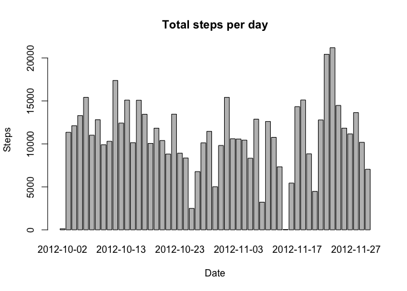
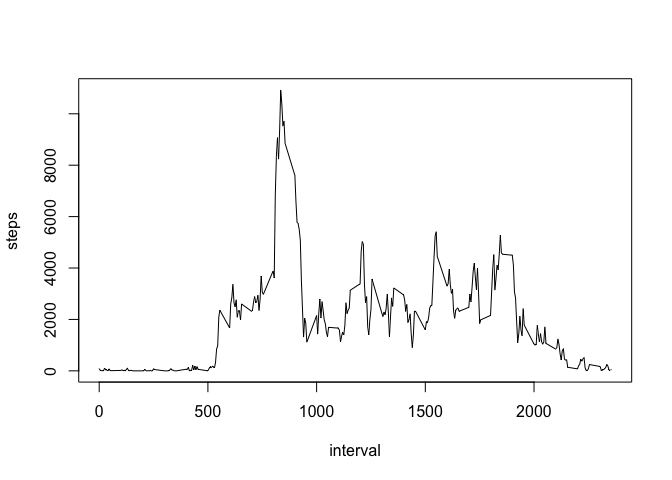
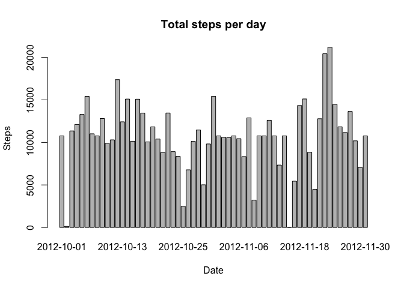
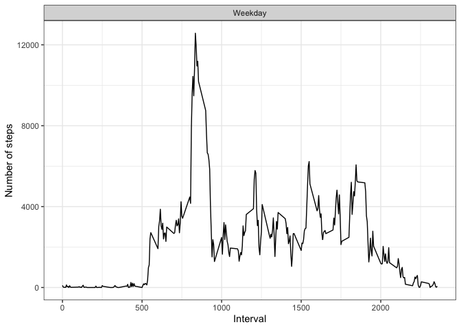

---
title: "RepData_PeerAssessment1"
author: Sunyx
date: August 11, 2019
output:
  html_document:
    keep_md: true
---
## Loading and preprocessing the data
Show any code that is needed to load the data.
Process/transform the data (if necessary) into a format suitable for your analysis

Calculate the total number of steps taken per day.
Make a histogram of the total number of steps taken each day


```r
setwd("~/Downloads")
Data <- read.csv("activity.csv")
totalSteps <-aggregate(steps~date,data=Data,sum,na.rm=TRUE)
barplot(totalSteps$steps, names.arg = totalSteps$date, main= "Total steps per day",xlab = "Date", ylab = "Steps")
```

<!-- -->

Calculate and report the mean and median of the total number of steps taken per day


```r
mean(totalSteps$steps)
```

```
## [1] 10766.19
```

```r
median(totalSteps$steps)
```

```
## [1] 10765
```

##What is the average daily activity pattern?

Make a time series plot (i.e. type ="l") of the 5-minute interval (x-axis) and the average number of steps taken, averaged across all days (y-axis)


```r
intervalSteps <- aggregate(steps~interval, Data, sum, na.rm=TRUE)
plot(steps~interval,data=intervalSteps,type="l")
```

<!-- -->

Which 5-minute interval, on average across all the days in the dataset, contains the maximum number of steps?

```r
intervalSteps[which.max(intervalSteps$steps),]$interval
```

```
## [1] 835
```

##Imputing missing values

Note that there are a number of days/intervals where there are missing values (coded as ????????). The presence of missing days may introduce bias into some calculations or summaries of the data.

Calculate and report the total number of missing values in the dataset (i.e. the total number of rows with ????????s)

```r
sum(is.na(Data$steps))
```

```
## [1] 2304
```

Devise a strategy for filling in all of the missing values in the dataset. The strategy does not need to be sophisticated. For example, you could use the mean/median for that day, or the mean for that 5-minute interval, etc.
Ans: I will use the mean for 5-min interval which should be a more accurate prediction of the missing values

Create a new dataset that is equal to the original dataset but with the missing data filled in.


```r
library(dplyr)
```

```
## 
## Attaching package: 'dplyr'
```

```
## The following objects are masked from 'package:stats':
## 
##     filter, lag
```

```
## The following objects are masked from 'package:base':
## 
##     intersect, setdiff, setequal, union
```

```r
NewData <- Data %>% group_by(interval) %>%
  mutate(steps = replace(steps, is.na(steps), mean(steps, na.rm = TRUE)))
```

Make a histogram of the total number of steps taken each day and Calculate and report the mean and median total number of steps taken per day. 

```r
totalNewSteps <- aggregate(steps ~ date, data = NewData, sum)
barplot(totalNewSteps$steps, names.arg = totalNewSteps$date, main= "Total steps per day",xlab = "Date", ylab = "Steps")
```

<!-- -->

Do these values differ from the estimates from the first part of the assignment? 
Ans: The graph is quite close to the first.

What is the impact of imputing missing data on the estimates of the total daily number of steps?

```r
mean(totalNewSteps$steps)
```

```
## [1] 10766.19
```

```r
median(totalNewSteps$steps)
```

```
## [1] 10766.19
```
Ans: Comparing this to the first set of data, the difference is very small: less than 1.

##Are there differences in activity patterns between weekdays and weekends?
Create a new factor variable in the dataset with two levels ??? ???weekday??? and ???weekend??? indicating whether a given date is a weekday or weekend day.

```r
NewDateData <- NewData %>% mutate(DayofWeek = ifelse(weekdays(as.Date(date)) %in% c("Saturday","Sunday"), "Weekend","Weekday"))
```

```
## Warning in strptime(xx, f <- "%Y-%m-%d", tz = "GMT"): unknown timezone
## 'zone/tz/2019b.1.0/zoneinfo/Asia/Shanghai'
```

```r
NewDateData$DayofWeek <- as.factor(NewDateData$DayofWeek)
```

Make a panel plot containing a time series plot (i.e. type = "l") of the 5-minute interval (x-axis) and the average number of steps taken, averaged across all weekday days or weekend days (y-axis). See the README file in the GitHub repository to see an example of what this plot should look like using simulated data.

```r
WeekDaySteps <- NewDateData %>% group_by(DayofWeek, interval) %>% summarise(Totalsteps=sum(steps))
library(ggplot2)
ggplot(WeekDaySteps, aes(x=interval, y=Totalsteps)) + 
  geom_line() + 
  facet_wrap(~ DayofWeek, nrow=2, ncol=1) +
  labs(x="Interval", y="Number of steps") +
  theme_bw()
```

<!-- -->
